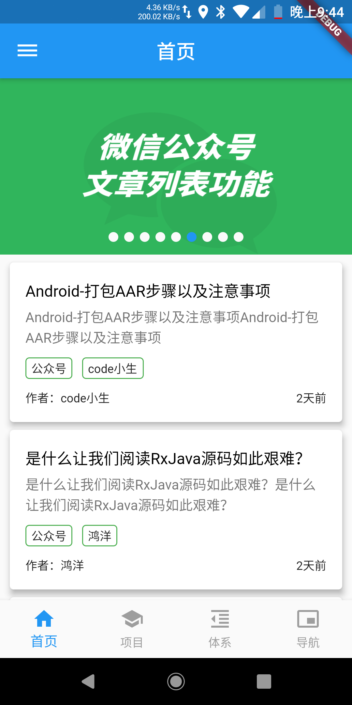
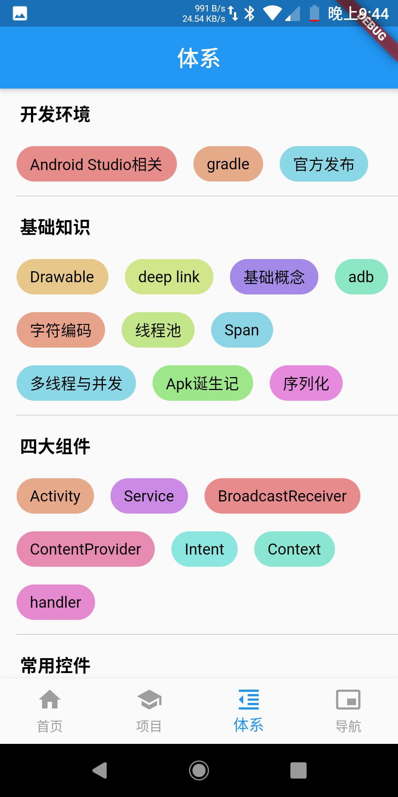
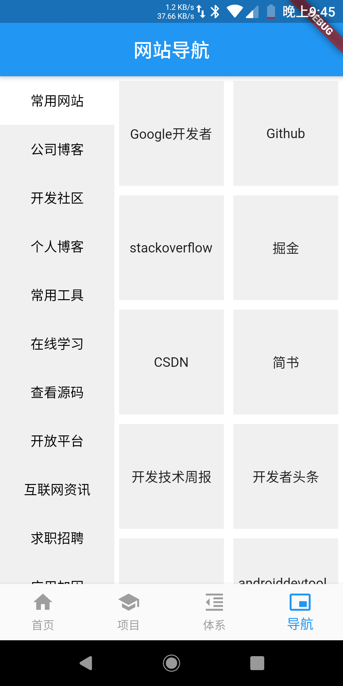
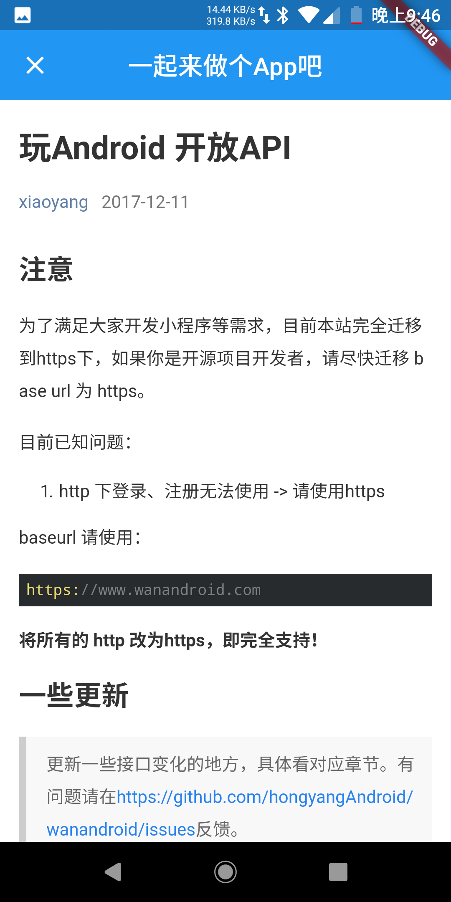
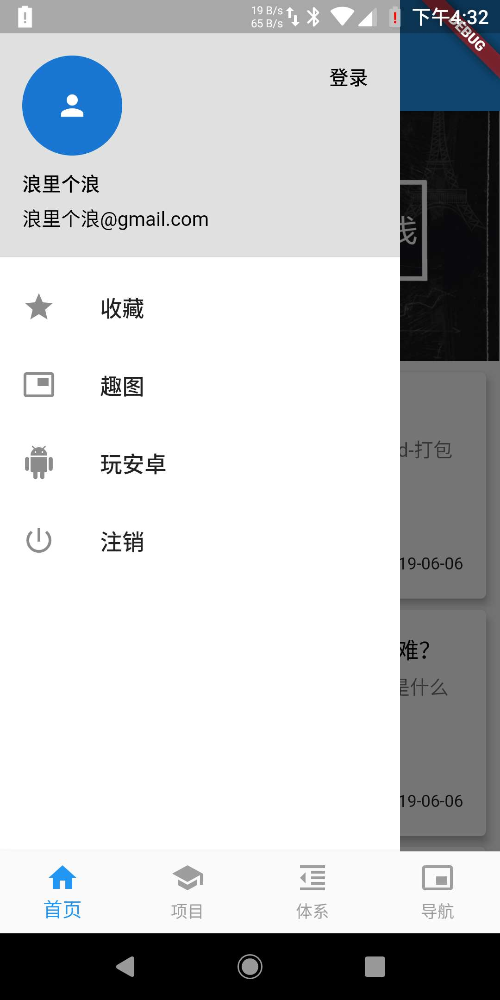

# flutter-WanAndroid

根据玩安卓开放API写的flutter项目

## 项目实现功能

项目分为四个模块分别为：首页、项目、体系、导航。

> 首页 ：主要实现banner和首页文章列表以及侧拉菜单的用户个人中心。

> 项目 ：主要实现的是项目分类以及项目列表数据。
 
> 体系 ：主要实现的是体系数据和知识体系下文章，包括基础知识、开发环境、常用控件等等。
 
> 导航 ：主要实现的是网站导航数据，包括常用网站、开发社区、个人博客、开放平台等等。

> 侧拉菜单 ：主要实现的是用户中心功能，包括注册、登录、注销、收藏等等

## 使用插件

- [flutter_swiper](https://pub.dev/packages/flutter_swiper)
- [flutter_webview_plugin](https://pub.dev/packages/flutter_webview_plugin)
- [http](https://pub.dev/packages/http)
- [toast](https://pub.dev/packages/toast)

## 项目截图

 | |  
:-------------------------:|:-------------------------:|:-------------------------:
 | |  

## TODO

>  收藏功能。

>  个人中心功能优化

>  启动页面

